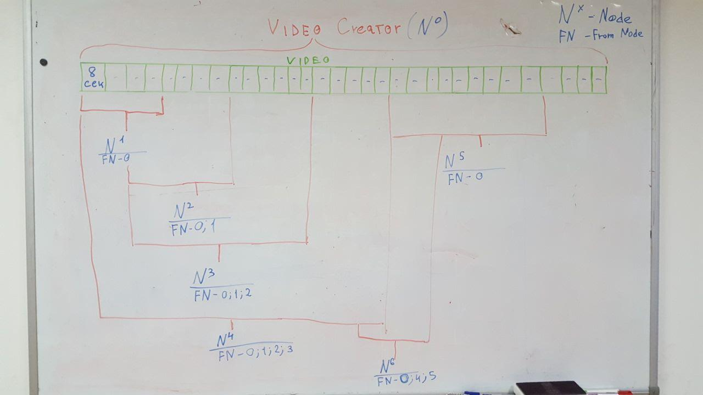

### Хранение и распространение видео контента
Все это работает по принципу торрентов, только эффективнее, т.к. каждое видео или видео поток(стрим) делится на мелкие фрагменты по 8 секунд по спецификации HLS. Это дает возможность смотреть видео не загружая его полностью, а только с нужного момента. 
Информация о каждом фрагменте фиксируется и указыается связь с предыдущим фрагментом, в результате чего мы получаем цепочку видео фрагментов которые связаны между собой. Изначально фрагменты хранит только Создатель, после того как Пользователь получил фрагмент он становится автоматически Распространитель. 

### Стримминг
Видео поток который создается и распространяется в режиме реального времени (Twich формат).
Перед созданием трансляции видео потока создается комната с названием трансляции в которую поступает информация о новых фрагментах.  
Далее Создатель генерирует фрагменты длительностью по 8 секунд, отправляя информацию о каждом фрагменте в комнату трансляции, Пользователь видит новый фрагмент видео в этой комнате и загружает напрямую от Создатель. Каждый кто скачал фрагмент становится его распространителем. Т.е. изначально фрагмент есть только у Создателя. Перый человек скачивает с него. Второй уже скачивает с создателя и первого, третий у создателя, первого и второго, и т.д. до 8. Ограничение на одновременное скачивание сделано, чтобы не перегружать узлы, и не перегружать свою сеть по количеству соединений. В результате в начале Создатель один распространяет свои видео фрагменты, после того как фрагмент получил хоть один Пользователь он перестает быть единственным Распространитель и нагрузка сильно снижается на узел, видео грузится очень быстро.

Видео фрагмент хранится у каждого Распространитель до тех пор пока выделеное место не закончится или просто его долгое время никто не запрашивает. Эта модель используется для видео стримминга, т.к. далеко не все лайвы нужно хранить. 
Хранение своего завершившегося стрима можно доверить Super Content Распространитель и не одному, а сразу 5-10 и т.д. зависит от цены на хранение, сумма хранения не будет превышать обычного облачного хранилища по типу Yandex Disk  

### Хранение информации

Поскольку технология распределяет информацию между пользователями, каждому пользователю необходимо выделять какое-то количество места на своём жестком диске для хранения. 
Объём выделяется по желанию пользователя и может быть изменём впоследствии.
При исчерпании отведенного пространства самая неактуальная информация заменяется на новую. 
Чтобы защитить фрагмент информации от случайного удаления пользователь может выбрать функцию "резервирвоания", что промаркерует фрагмент как невозможный для удаления. 
Для того, чтобы информация была доступна для скачивания другим пользователям, хранитель должен быть онлайн.
В описанной логике распросранения функция хранения информации приобретает дополнительную вожность. Любой пользователь по желанию может взять на себя функцию хранения и пребывания онлайн, став "лояльным пользователем", тем самым поддержав автора и сообщество его зрителей. 
Однако при внушительной аудитории подобная необходимость снижается, поскольку для эффективной работы системы достаточно, чтобы онлайн был хотя бы один человек. И чем больше аудитори, тем выше вероятность, что в любой момент времени кто-то обязательно будет онлайн. 
